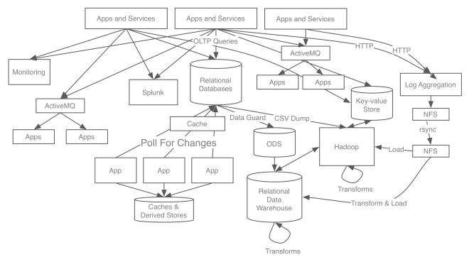
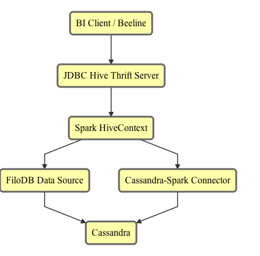

## <span class="scalared">NoLambda</span>: Combining Streaming,
## Ad-Hoc, Machine Learning, and
## Batch Analytics

&nbsp;<p>
### [Evan Chan](https://twitter.com/Evanfchan) and [Helena Edelson](https://twitter.com/helenaedelson)
### March 2016

---

## Evan Chan

<center>

</center>

- Distinguished Engineer, [Tuplejump](http://www.tuplejump.com)
- [@evanfchan](https://twitter.com/Evanfchan)
- [`http://velvia.github.io`](http://velvia.github.io)
- User and contributor to Spark since 0.9, Cassandra since 0.6
- Co-creator and maintainer of [Spark Job Server](http://github.com/spark-jobserver/spark-jobserver)

---

## Helena Edelson
<center>[@helenaedelson](https://twitter.com/helenaedelson) | [`github.com/helena`](http://github.com/helena)</center>
<br/>

- VP of Product Engineering, [Tuplejump](http://www.tuplejump.com)
- Working on event-driven systems for 15 years
- Committer: Kafka Connect Cassandra, Spark Cassandra Connector
- Contributor: Akka, Spring Integration
- Speaker: Spark Summit, Kafka Summit, Strata, QCon, Scala Days, Scala World, Philly ETE 


---

## Tuplejump

[Tuplejump](http://tuplejump.com) is a big data technology leader providing solutions and development partnership.

---

##  [Tuplejump](http://tuplejump.com) Open Source: on GitHub

* [FiloDB](http://github.com/tuplejump/FiloDB) - Subject of today's talk
* [Kafka Connect Cassandra](http://github.com/tuplejump/kafka-connect-cassandra) - Kafka-Cassandra Source and Sink
* [Calliope](http://tuplejump.github.io/calliope/) - The first Spark Cassandra integration
* [Stargate](http://tuplejump.github.io/stargate/) - Lucene indexer for Cassandra
* [SnackFS](https://github.com/tuplejump/snackfs) - HDFS for Cassandra

---

## Tuplejump Consulting & Development

<center>

</center>

---

<center>
**Tuplejump Blender** 
<small>Builds unified datasets for fast querying, streaming and batch sources, ML and Analytics</small>
</center>
<center>
 
</center>

---

## Topics

- Modern streaming and batch/ad-hoc architectures
- Pitfalls and Simplification
- Precise and scalable streaming ingestion
- FiloDB and fast analytics with competitive storage cost
- Use Cases
  - Data Warehousing with Spark, Cassandra, and FiloDB
  - Time series / event data / geospatial examples
  - Machine learning using Spark MLLib + Cassandra/FiloDB

---

## Delivering Meaning
<br/>

- Terabytes of data / day
- Billions of events per second
  - Sub-second, low latency stream processing
  - Higher latency stream processing
  - Batch / scheduled processing
- Many data streams
- Disparate sources and schemas

---

## The Problem Domain
<br/>
Build scalable, adaptable, self-healing, distributed data processing systems that handle

- 24 / 7 system uptime
  - Rolling restarts for streams
- Complex analytics and learning tasks
- Aggregation of global data
- Ops for global, multi-dc clustered data flows
- Decoupled
- Scale
- No data loss
- Idempotent

---

## Factors & Constraints in Architecture
<br/>

- Corner cases, Industry use cases
- Legal constraints - user data crossing borders
- % Writes on ingestion, % Reads 
- How much in memory?
- Counters? Geo-locational?
- JDK version for cloud deployments
- Dimensions of data in queries
- What needs real time feedback loops

### The list goes on...

---

## Self-Healing Systems
<br/>

- Massive event spikes & bursty traffic
- Fast producers / slow consumers
- Network partitioning & out of sync systems 
- DC down 
- Not DDOS'ing ourselves from fast streams
- No data loss when auto-scaling down

---

## Use Case

<center>I need fast access to historical data on the fly for predictive modeling 
        with real time data from the stream 
</center>
<center>

</center>

---

## Only, It's Not A Stream It's A Flood
<br/>

- Billions of writes per day
- Trillions of read per day
- Millions of events per second at peak
- Petabytes of total streaming data

---

## Bounds of Data Ingestion
<br/>
<center>Individual stream patterns differ in daily, hourly, peak volume, frequency, peak spikes.</center>
<br/>

#### Real Time | Sub-second | Second and higher

---

## Real Time
<center>Just means **Event Driven** or processing events as they arrive.
        It doesn't automatically equal sub-second latency requirements.
</center>

---

## Stream Processing 
- Kafka - Foundation to streaming architecture
- Samza - Just streaming
- Gearpump - Real-time big data streaming

<br/>

## Analytics Stream Processing
- Storm - Real-time Analytics, ML, needs Trident to stream
- Flink - Real-time Analytics, ML, Graph 
- Spark Streaming - Micro-batch Analytics, ML, Graph

---

## Legacy Infrastructure
<br/>

- Highly-invested-in existing architecture around Hadoop
- Existing analytics logic for scheduled MR jobs

---

## Lambda Architecture

*A data-processing architecture designed to handle massive quantities 
of data by taking advantage of both batch and stream processing methods.*

---

## Lambda Architecture

<center>

</center>

<center>
(https://www.mapr.com/developercentral/lambda-architecture)
</center>

---

## λ The Good
<br/>

- Immutability - retaining master data
  - With timestamped events
  - Appended versus overwritten events
- Attempt to beat CAP
- Pre-computed views for 
  - further processing
  - faster ad-hoc querying

---

## λ The Bad
<br/>

- Two Analytics systems to support
- Operational complexity
- By the time a scheduled job is run 90% of the data is stale
- Many moving parts: KV store, real time platform, batch technologies
- Running similar code and reconciling queries in *dual systems*
- Analytics logic changes on *dual systems*

---

## λ The Overly Complicated
<br/>

<center>
*Immutable sequence of records is ingested and fed into*
</center>
<br/> 

- a batch processing system
- and a stream processing system 
- in parallel

<br/>

### Ultimately Very High TCO And...

---

<center>

<!-- .element: class="fullwidth" -->

<!-- .element: class="fullwidth" -->
</center>

---

## Are Batch and Streaming Systems Fundamentally Different?
<br/>

- Why is batch processing not thought of as a stream?
- Are we not accumulating events from *T-1* to *T-n* 
- Or bucketed by Year-Month-Day-Hour?
- Can't we process everything as a stream?

---

## A Unified Streaming Architecture
<center>
Everything On The Streaming Platform</center>
<br/>

- Scala / Spark Streaming
- Mesos
- Akka
- Cassandra
- Kafka

---

## SNACK (SMACK) Stack

<center>

</center>

---

<center>

<!-- .element: class="mermaid" -->
</center>

- High Throughput Distributed Messaging
- High Scalability - billions of events per day
- Durability - no data loss
- Immutability
- Support Massive Number of Consumers
- Very efficient and low latency
- Decouples Data Pipelines
- Automatic recovery from broker failures

---

## Stream Processing Simplified

### Kafka Streams

- New Kafka Streams coming in v0.10
- Removes the need to run another framework like Storm alongside Kafka
- Removes the need for separate infrastructures

---

## Kafka Streams

A library for building streaming applications, specifically applications that transform input Kafka topics into 
output Kafka topics, with concise code, distribution and fault tolerance.

- Common stream operations, e.g. join, filter, map, etc.
- Windowing
- Proper time modeling, e.g. event time vs. processing time
- Local state management with persistence and replication
- Schema and Avro support

---

## Spark Streaming  

<center>Iterative ML, Interactive Querying, Graph, DataFrames</center>

<center>

</center>

- One runtime for streaming and batch processing
- Join streaming and static data sets 
- No code duplication
- Easy Kafka stream integration
- Easy to reconcile queries against multiple sources
- Easy integration of KV durable storage

---

## <span class="cassred">Apache Cassandra</span>

<center>
 
</center>

- Horizontally scalable
- Multi-Region / Multi-Datacenter
- Always On - Survive regional outages
- Extremely fast writes: - perfect for ingestion of real time / machine data
- Very flexible data modelling (lists, sets, custom data types)
- Easy to operate
- Best of breed storage technology, huge community
- **BUT: Simple queries only**
- **OLTP-oriented**/center

---

<center>

</center>

- High performance concurrency framework for Scala and Java 
- Fault Tolerance
- Asynchronous messaging and data processing 
- Parallelization
- Location Transparency
- Local / Remote Routing 
- Akka: Cluster / Persistence / Streams

---

## Enables
### Streaming and Batch In One System

<center>Streaming ML and Analytics for Predictions In The Stream</center>

<center>

</center>

<center>Show me the codez</center>

---

## Kafka Streams

```scala
val builder = new KStreamBuilder()
val stream: KStream[K,V] = builder.stream(kdes,vdes, "raw.data.topic")
  .flatMapValues(value -> Arrays.asList(value.toLowerCase.split("")
  .map((k,v) -> new KeyValue(k,v))
  .countByKey(...)
  .toStream()
  
stream.to("results.topic", ...)

val streams = new KafkaStreams(builder, props)
streams.start()

```

---

## Immutable Raw Data From Kafka Stream
<center>Replaying data streams: for fault tolerance, logic changes..</center>

```scala
class KafkaStreamingActor(ssc: StreamingContext, settings: Settings) extends AggregationActor {
  
  val stream = KafkaUtils.createDirectStream(...)
.map(RawWeatherData(_))
  stream
    .foreachRDD(_.toDF.write.format("filodb.spark"))
    .option(rawDataKeyspace, rawDataTable)
 
  /* Pre-Aggregate data in the stream for fast querying and aggregation later. */
 
   stream.map(hour => 
     (hour.wsid, hour.year, hour.month, hour.day, hour.oneHourPrecip)
  ).saveToCassandra(CassandraKeyspace, CassandraTableDailyPrecip)
 
}
```

---

### Reading Data Back From Cassandra
#### Compute isolation in Akka Actor

```scala
class TemperatureActor(sc: SparkContext, settings: Settings) extends AggregationActor {
  
  import settings._
  import akka.pattern.pipe
  
  def receive: Actor.Receive = {
    
    case e: GetMonthlyHiLowTemperature => highLow(e, sender)
  
  }
 
  
  
  def highLow(e: GetMonthlyHiLowTemperature, requester: ActorRef): Unit =
    
    sc.cassandraTable[DailyTemperature](timeseriesKeyspace, dailyTempAggregTable)
      
      .where("wsid = ? AND year = ? AND month = ?", e.wsid, e.year, e.month)
      .collectAsync()
      
      .map(MonthlyTemperature(_, e.wsid, e.year, e.month)) pipeTo requester
}
```

---

## Spark Streaming, MLLib
## Kafka, Cassandra

```scala
val ssc = new StreamingContext(sparkConf, Seconds(5)

val testData = ssc.cassandraTable[String](keyspace,table)
  .map(LabeledPoint.parse)
      
val trainingStream = KafkaUtils.createDirectStream[_,_,_,_](..)
    .map(transformFunc)
    .map(LabeledPoint.parse)
    
trainingStream.saveToCassandra("ml_training_keyspace", "raw_training_data")
 
    

val model = new StreamingLinearRegressionWithSGD()
  
  .setInitialWeights(Vectors.dense(weights))
  
  .trainOn(trainingStream)
     
model
  .predictOnValues(testData.map(lp => (lp.label, lp.features)))
  .saveToCassandra("ml_predictions_keyspace", "predictions")

```

---

## What's Missing? One Pipeline For Fast + Big Data


<!-- .element: class="mermaid" -->

---

## Using Cassandra for Batch Analytics / Event Storage / ML?

- Storage efficiency and scan speeds for reading large volumes of data (for complex analytics, ML) become important concerns
- Regular Cassandra CQL tables are not very good at either storage efficiency or scan speeds
- A different, analytics-optimized solution is needed...

---

> All hard work leads to profit, but mere talk leads to poverty.<br>
> - Proverbs 14:23

---

## Introducing <span class="golden">FiloDB</span>

<center>
A distributed, versioned, columnar analytics database.<br>
*Built for Streaming.*
</center>

<p>&nbsp;<p>
<center>
[github.com/tuplejump/FiloDB](http://github.com/tuplejump/FiloDB)
</center>

--

## Fast Analytics Storage

- Scan speeds competitive with Apache Parquet
  + Up to 200x faster scan speeds than with Cassandra 2.x
- Flexible filtering along two dimensions
  + Much more efficient and flexible partition key filtering
- Efficient columnar storage, up to 27x more efficient than Cassandra 2.x

NOTE: 200x is just based on columnar storage + projection pushdown - no filtering on sort or partition keys, and no caching done yet.

--

## Comparing Storage Costs and Query Speeds

<center>

</center>

<center>
[https://www.oreilly.com/ideas/apache-cassandra-for-analytics-a-performance-and-storage-analysis](https://www.oreilly.com/ideas/apache-cassandra-for-analytics-a-performance-and-storage-analysis)
</center>

--

## Robust Distributed Storage

Apache Cassandra as the rock-solid storage engine.  Scale out with no SPOF.  Cross-datacenter replication.
Proven storage and database technology.

--

## Cassandra-Like Data Model

<table>
  <tr>
    <td></td>
    <td colspan="2">Column A</td>
    <td colspan="2">Column B</td>
  </tr>
  <tr>
    <td>Partition key 1</td>
    <td>Segment 1</td>
    <td>Segment 2</td>
    <td>Segment 1</td>
    <td>Segment 2</td>
  </tr>
  <tr>
    <td>Partition key 2</td>
    <td>Segment 1</td>
    <td>Segment 2</td>
    <td>Segment 1</td>
    <td>Segment 2</td>
  </tr>
</table>
&nbsp;<p>

- **partition keys** - distributes data around a cluster, and allows for fine grained and flexible filtering
- **segment keys** - do range scans within a partition, e.g. by time slice
- primary key based ingestion and updates

--

## Flexible Filtering

Unlike Cassandra, FiloDB offers very flexible and efficient filtering on partition keys.  Partial key matches, fast IN queries on any part of the partition key.  
<br/>
*No need to write multiple tables to work around answering different queries.*

--

## Spark SQL Queries!

```sql
CREATE TABLE gdelt USING filodb.spark OPTIONS (dataset "gdelt");

SELECT Actor1Name, Actor2Name, AvgTone FROM gdelt ORDER BY AvgTone DESC LIMIT 15;

INSERT INTO gdelt SELECT * FROM NewMonthData;
```

- Read to and write from Spark Dataframes
- Append/merge to FiloDB table from Spark Streaming
- Use Tableau or any other JDBC tool

--

## What's in the name?

<center>

</center>

Rich sweet layers of distributed, versioned database goodness

--

## SNACK (SMACK) stack for all your Analytics


<!-- .element: class="mermaid" -->

- Regular Cassandra tables for highly concurrent, aggregate / key-value lookups (dashboards)
- FiloDB + C* + Spark for efficient long term event storage
  - Ad hoc / SQL / BI
  - Data source for MLLib / building models
  - Data storage for classified / predicted / scored data

--


--

## Being Productionized as we speak...

- One enterprise with many TB of financial and reporting data is moving their data warehouse to FiloDB + Cassandra + Spark
- Another startup uses FiloDB as event storage, feeds the events into Spark MLlib, scores incoming data, then stores the results back in FiloDB for low-latency use cases
  + From their CTO: “I see close to MemSQL / Vertica or even better”  “More cost effective than Redshift”

---

## Data Warehousing with <span class="golden">FiloDB</span>

--

## Scenarios

- BI Reporting, concurrency + seconds latency
- Ad-hoc queries
- Needing to do JOINs with fact tables + dimension tables
  + Slowly changing dim tables / hard to denormalize
- Need to work with legacy BI tools

--

## Real-world DW Architecture Stack


<!-- .element: class="mermaid" -->

<center>
Efficient columnar storage + filtering = low latency BI
</center>

--

## Modeling Fact Tables for FiloDB

- Single partition queries are really fast and take up only one thread
  + Given the following two partition key columns: entity_number, year_month
  + `WHERE entity_number = '0453' AND year_month = '2014 December'`
    * Exact match for partition key is pushed down as one partition
- Consider the partition key carefully

--

## Cassandra often requires multiple tables

What about the queries that do not translate to one partition?  Cassandra has many restrictions on partition key filtering (as of 2.x).

- Table 1:  partition key = `(entity_number, year_month)`
  + Can push down: `WHERE entity_number = NN AND year_month IN ('2014 Jan', '2014 Feb')` as well as equals
- Table 2:  partition key = `(year_month, entity_number)`
  + Can push down: `WHERE year_month = YYMM AND entity_number IN (123, 456)` as well as equals

IN clause must be the last column to be pushed down. Two tables are needed just for efficient IN queries on either entity_number or year_month.

--

## FiloDB Flexible Partition Filters = WIN

With ONE table, FiloDB offers FAST, arbitrary partition key filtering.  All of the below are pushed down:

- `WHERE year_month IN ('2014 Jan', '2014 Feb')` (all entities)
- `WHERE entity_number = 146`  (all year months)
- Any combo of =, IN

<p>
<center><large>
Space savings: 27 `*` 2 = **54x**
</large>
</center>

--

## Multi-Table JOINs with just Cassandra

<center>

</center>

--

## Sub-second Multi-Table JOINs with FiloDB

<center>

</center>

--

## Sub-second Multi-Table JOINs with FiloDB

- Four tables, all of them single-partition queries
- Two tables were switched from regular Cassandra tables to FiloDB tables.  40-60 columns each, ~60k items in partition.
- Scan times went down from 5-6 seconds to < 250ms

<p>
For more details, please see this [Planet Cassandra blog post](http://www.planetcassandra.org/blog/achieving-sub-second-sql-joins-and-building-a-data-warehouse-using-spark-cassandra-and-filodb/).

---

## Scalable Time-Series / Event Storage with <span class="golden">FiloDB</span>

--

## Designed for Streaming

- New rows appended via Spark Streaming or Kafka
- Writes are *idempotent* - easy **exactly once** ingestion
- Converted to columnar chunks on ingest and stored in C*
- FiloDB keeps your data sorted as it is being ingested

--

## Spark Streaming -> FiloDB

```scala
    val ratingsStream = KafkaUtils.createDirectStream[String, String, StringDecoder, StringDecoder](ssc, kafkaParams, topics)
    ratingsStream.foreachRDD {
      (message: RDD[(String, String)], batchTime: Time) => {
        val df = message.map(_._2.split(",")).map(rating => Rating(rating(0).trim.toInt, rating(1).trim.toInt, rating(2).trim.toInt)).
          toDF("fromuserid", "touserid", "rating")
      
        // add the batch time to the DataFrame
        val dfWithBatchTime = df.withColumn("batch_time", org.apache.spark.sql.functions.lit(batchTime.milliseconds))
      
        // save the DataFrame to FiloDB
        dfWithBatchTime.write.format("filodb.spark")
          .option("dataset", "ratings")
          .save()
      }
    }
```
One-line change to write to FiloDB vs Cassandra

--

## Modeling example: NYC Taxi Dataset

The public [NYC Taxi Dataset](http://www.andresmh.com/nyctaxitrips/) contains telemetry (pickup, dropoff locations, times) info on millions of taxi rides in NYC.

| Medallion prefix  | 1/1 - 1/6   |  1/7 - 1/12  |
| ----------------- | ----------- | ------------ |
| AA             | records     |  records     |
| AB             | records     |  records     |

* Partition key - `:stringPrefix medallion 2` - hash multiple drivers trips into ~300 partitions
* Segment key - `:timeslice pickup_datetime 6d`
* Row key - hack_license, pickup_datetime

Allows for easy filtering by individual drivers, and slicing by time.

--

# DEMO TIME

### New York City Taxi Data Demo (Spark Notebook)

To follow along:  https://github.com/tuplejump/FiloDB/blob/master/doc/FiloDB_Taxi_Geo_demo.snb

---

## Fast, Updatable In-Memory
## Columnar Storage


<!-- .element: class="mermaid" -->

- Unlike RDDs and DataFrames, FiloDB can ingest new data, and still be fast
- Unlike RDDs, FiloDB can filter in multiple ways, no need for entire table scan
- FAIR scheduler + sub-second latencies => web speed queries

--

## 700 Queries Per Second in Apache Spark!

- Even for datasets with 15 million rows!
- Using FiloDB's `InMemoryColumnStore`, single host / MBP, 5GB RAM
- SQL to DataFrame caching

For more details, see [this blog post](http://velvia.github.io/Spark-Concurrent-Fast-Queries/).

---

## Machine Learning with Spark, Cassandra, and FiloDB

--

## Building a static model of NYC Taxi Trips

- Predict time to get to destination based on pickup point, time of day, other vars
- Need to read all data (full table scan)

--

## Dynamic models are better than static models

- Everything changes!
- Continuously refine model based on recent streaming data + historical data + existing model

--

```scala
val ssc = new StreamingContext(sparkConf, Seconds(5)
)
val dataStream = KafkaUtils.createDirectStream[..](..)
    .map(transformFunc)
    .map(LabeledPoint.parse)
    
dataStream.foreachRDD(_.toDF.write.format("filodb.spark")
                                .option("dataset", "training").save())
    
if (trainNow) {
  
var model = new StreamingLinearRegressionWithSGD()
  
    .setInitialWeights(Vectors.dense(weights))
  
    .trainOn(dataStream.join(historicalEvents))
}
     
model.predictOnValues(dataStream.map(lp => (lp.label, lp.features)))
     .insertIntoFilo("predictions")
```

--


--

## The FiloDB Advantage for ML

- Able to update dynamic models based on massive data flow/updates
  + Integrate historical and recent events to build models
- More data -> better models!
- Can store scored raw data / predictions back in FiloDB
  + for fast user queries

---

## FiloDB - Roadmap

Your input is appreciated!

* Productionization and automated stress testing
* Kafka input API / connector (without needing Spark)
* In-memory caching for significant query speedup
* True columnar querying and execution, using late materialization and vectorization techniques.  GPU/SIMD.
* Projections.  Often-repeated queries can be sped up significantly with projections.

---

## Thanks For Attending!
 
- [@helenaedelson](https://twitter.com/helenaedelson)
- [@evanfchan](https://twitter.com/Evanfchan)
- [@tuplejump](https://twitter.com/tuplejump) 

---

# EXTRA SLIDES

---

## What are my storage needs?

- Non-persistent / in-memory: concurrent viewers
- Short term: latest trends
- Longer term: raw event and aggregate storage
- ML Models, predictions, scored data

--

## Spark RDDs

- Immutable, cache in memory and/or on disk
- Spark Streaming: UpdateStateByKey
- IndexedRDD - can update bits of data
- Snapshotting for recovery

--

## Using Cassandra for Short Term Storage

|          | 1020s | 1010s | 1000s |
| -------- | ----- | ----- | ----- |
| Bus A    | Speed, GPS |   |      |
| Bus B    |       |        |      |
| Bus C    |       |        |      |

- Primary key = (Bus UUID, timestamp)
- Easy queries: location and speed of single bus for a range of time
- Can also query most recent location + speed of all buses (slower)

---

## <span class="golden">FiloDB</span> - How?

--

## Multiple ways to Accelerate Queries

* Columnar projection - read fewer columns, saves I/O
* Partition key filtering - read less data
* Sort key / PK filtering - read from subset of keys
  - Possible because FiloDB keeps data sorted
* Versioning - write to multiple versions, read from the one you choose

--

## Cassandra CQL vs Columnar Layout

Cassandra stores CQL tables row-major, each row spans multiple cells:

| PartitionKey | 01:first | 01:last | 01:age | 02:first | 02:last | 02:age |
| :----------- | :------- | :------ | -----: | :------- | :------ | -----: |
| Sales        | Bob      | Jones   | 34     | Susan    | O'Connor | 40    |
| Engineering  | Dilbert  | P       | ?      | Dogbert  | Dog     |  1     |

&nbsp;<p>
Columnar layouts are column-major:

| PartitionKey | first  |  last  |  age  |
| :----------- | ------ | ------ | ----- |
| Sales        | Bob, Susan | Jones, O'Connor | 34, 40 |
| Engineering  | Dilbert, Dogbert | P, Dog    | ?, 1   |

--

## FiloDB Cassandra Schema

```sql
CREATE TABLE filodb.gdelt_chunks (
    partition text,
    version int,
    columnname text,
    segmentid blob,
    chunkid int,
    data blob,
    PRIMARY KEY ((partition, version), columnname, segmentid, chunkid)
) WITH CLUSTERING ORDER BY (columnname ASC, segmentid ASC, chunkid ASC)
```

--

## FiloDB Architecture

<center>

</center>

ColumnStore API - currently Cassandra and InMemory, you can implement other backends - ElasticSearch?  etc.

